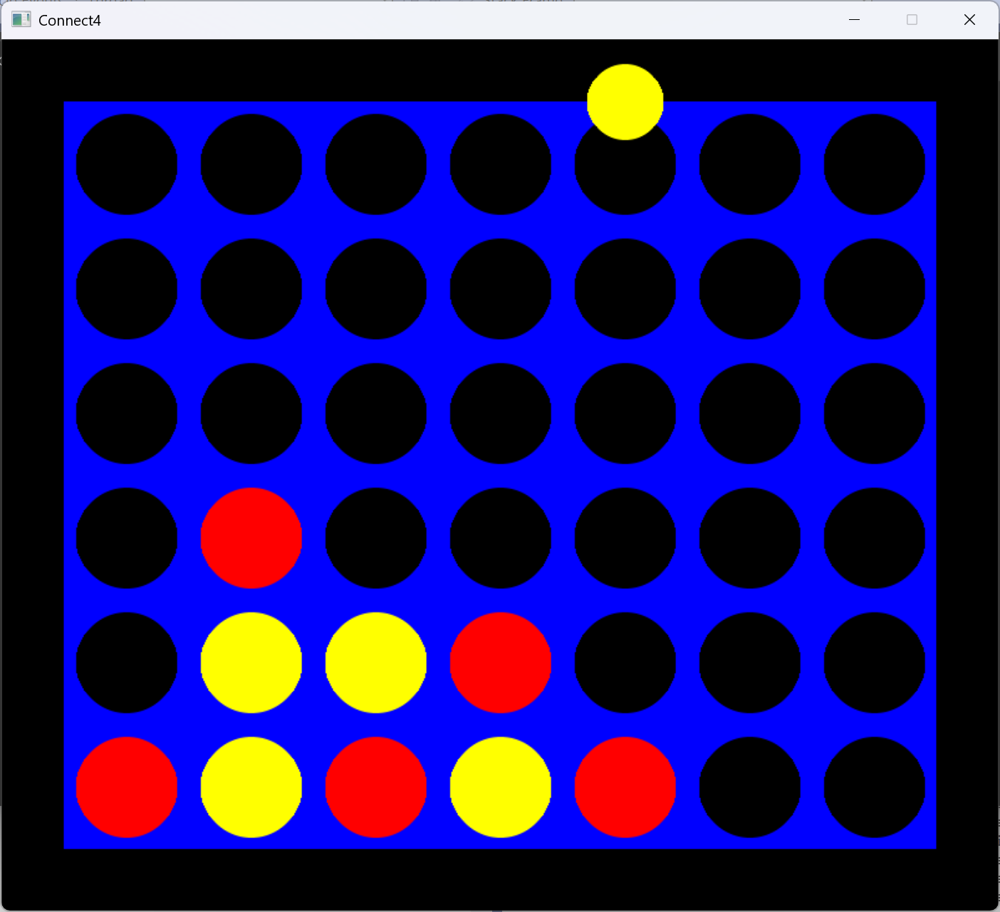

# Project 04 – Connect Four
 
## ??? Description
 
This is a turn-based grid game written in C++ using SDL2. Players take turns placing pieces into columns using the mouse or keyboard. 
The goal is to connect four pieces in a row — horizontally, vertically, or diagonally. The first player to do so wins. Pieces fall to 
the lowest available slot in the selected column. 

## ?? Controls
 
- Press a number key (1–7) or click a column to place a piece.
- Press 'R' or click the green replay button to restart.
- Press 'Esc' or click the red X to quit.
 
## ?? Screenshot
 

 
## ? Extra Features
 
- Hovering over a column shows the current player's piece above that column.
- The game is fully playable via either keyboard or mouse.
- Press 'R' and 'Esc' anytime for quick restarts and exits.
